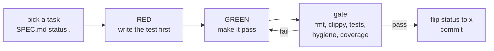

# Contributing to itok

`itok` is built **spec-first**. The design and the build queue are the same
document: `SPEC.md`. Contributing means picking the next task from that
queue and making it pass the guards. A human or an agent can drive the
loop the same way.

## The loop



- **`SPEC.md` is the queue.** Each `§T` row has a status: `.` not started,
  `~` in progress, `x` done. Pick the lowest-numbered `.` whose
  dependencies are met.
- **The guards are the gate.** Every change is held to the same standard,
  so a wrong step *fails* instead of silently shipping. That is what lets
  the loop run without constant supervision.
- **The invariants are the law.** `§V` records why things are the way they
  are. A task cites the invariants it must respect; read them before you
  start.

## Setup

The toolchain is pinned. From a checkout:

```bash
nix develop                    # drops you into the pinned shell
cargo nextest run              # run the tests
cargo clippy --all-targets     # the deny-list is strict on purpose
cargo fmt --all                # formatting is not optional
```

No `nix`? A recent stable Rust with `cargo-nextest` and `cargo-llvm-cov`
works too; the pinned shell just guarantees the versions.

## Adding a verb

The command surface is a pure function -- `cli::run(args) -> Output` --
so nearly everything is unit- and property-tested at library cost, not by
spawning the binary. To add a verb:

1. Add a variant to `Verb` and a row to the `VERBS` table in `verb.rs`.
   The `match` in `dispatch` is exhaustive, so the compiler will tell you
   what is missing until it is wired.
2. Put the logic in its own module, tested there. Reuse the shared
   machinery (`estimate`, `walk`, `render`, `json`, the unit parser) --
   it is already tested, so your verb adds little.
3. Write the tests first. Wiring is a unit test against `run`; the
   permutation space is a `proptest` invariant, not a hand-enumerated
   list. Only the process boundary (exit code, stream routing) needs an
   end-to-end test.

## What the gate checks

A commit must pass all of these -- the pre-commit hook runs them:

- **`cargo fmt --check`** -- one formatting, no debate.
- **`cargo clippy`** -- a strict deny-list (no `unwrap`, no `panic`, no
  silent integer overflow, function- and module-length caps). The limits
  are a design tool: if a function will not fit, it usually wants
  splitting.
- **`cargo nextest`** -- unit and property tests.
- **repo hygiene** -- ASCII-only source, no machine-specific paths, no
  oversized files (`.file-limits`).
- **coverage** -- per-file, frozen. A drop is a reviewed decision, not an
  accident. Cover the gap rather than lower the bar.
- **lexicon** -- new identifiers are a reviewed diff, so the vocabulary
  stays small (`itok e` beats `itok execute-estimation`).

## Design laws worth knowing

Two invariants shape almost every decision here (`§V` has the rest):

- **Convention over novelty.** Default to the form `git`, `du`, or `rg`
  already use. Convention is free -- it lives in muscle memory and in a
  model's prior -- and novelty is taxed every time it must be taught.
- **Estimation, honestly.** The default is an estimate and says so. A
  number always names its method and marks whether it is crude. `itok`
  never claims a measurement it cannot make.

## Commits

One logical change per commit, and the commit message carries the *why*,
not just the *what*. When a task completes, flip its `§T` status to `x` in
the same change.
