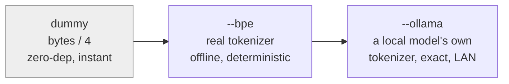

# itok

[](https://github.com/pr0d1r2/itok/actions/workflows/ci.yml)
[](https://crates.io/crates/itok)
[](https://docs.rs/itok)


Estimate the token / context cost of files and changes, from the command
line. `git`- and `du`-shaped, so if you know those tools you already know
this one.

Honest by design: the default is an *estimate* and says so out loud.
`itok` never claims a measurement it cannot make.

```text
$ itok estimate -h --top 3
   ~38k itok  SPEC.md
    ~4k itok  crates/itok/SPEC.md
    ~4k itok  Cargo.lock
   ~47k itok  total (bytes/4)
```

- `itok` = **input tokens** -- what a file costs fed *into* a model
  (not output/generation).
- `~` marks a **crude estimate**. A real tokenizer count drops it.
- `(bytes/4)` names the **method**, so the number always says how it was
  reached.

## Install

```bash
cargo install itok
```

With [Nix](https://nixos.org), no Rust toolchain needed:

```bash
nix run github:pr0d1r2/itok -- estimate SPEC.md   # run without installing
nix profile install github:pr0d1r2/itok           # or install
```

Three outputs: `default` (the `--bpe` tokenizer included), `itok-minimal`
(the zero-dependency `bytes/4` core), and `itok-ollama` (adds the
LAN-exact tier).

Or from a checkout:

```bash
cargo install --path crates/itok    # inside the monorepo
```

That puts `itok` in `~/.cargo/bin` -- make sure it is on your `PATH`.

## Prefix inference

Verb names support **prefix inference**: any unambiguous prefix works, so
`itok e`, `itok est`, and `itok estimate` are the same command. A typo that
is not a prefix is *suggested*, never run:

```bash
$ itok esimate
itok: unknown command 'esimate' -- did you mean estimate?
```

The full command reference is [below](#commands); `itok docs` prints it and
is the source of that section.

## The precision ladder

An estimate is only as good as its method. `itok` offers a ladder from
cheap-and-crude to true, and always labels which rung produced a number.



All three rungs are built. `dummy` (`bytes/4`, the ~4-chars-per-token rule
of thumb, off by roughly 15-30%) is the zero-dependency default; `--bpe`
is a real tokenizer (o200k, offline, deterministic, no tilde); `--ollama`
gets an exact count from a local model's own tokenizer over the LAN --
keyless, no cloud, no network in the core. Because every number names its
method, you always know which you are looking at.

## Budgets

Supplying `--budget N` turns `estimate` (or `diff`) into a gate: it fails
if a file -- or a change's delta -- exceeds the budget. The report still
prints; the breach goes to stderr; the exit code is `1`.

```bash
$ itok estimate --budget 20k SPEC.md
   ~38k itok  SPEC.md
   ~38k itok  total (bytes/4)
itok: 1 file(s) over budget 20000:
  38785 itok  SPEC.md
$ echo $?
1
```

`N` accepts a decimal unit: `2000`, `15k`, `1M`. Drop it into CI as a
one-line ceiling with no config file to maintain.

## JSON output

`--format json` is a **stable contract** -- one JSON object per file, so
tools can parse it without guessing:

```bash
$ itok estimate --format json SPEC.md
{"path":"SPEC.md","tokens":38785,"unit":"input_tokens","estimated":true,"method":"bytes/4"}
```

`estimated` is `true` for a crude tier and `false` for a real tokenizer --
the machine-readable form of the `~` marker.

<!-- BEGIN itok docs -->
## Commands

Every verb, its synopsis and what it does. Regenerate with `itok docs`.

### `estimate`

```text
estimate [-s] [-h] [--top N] [--budget N] [--bpe] [--ollama[=HOSTS]] [--format human|json] [-C dir] [paths...]
```

Token cost of files, git-tracked by default. `--bpe` swaps bytes/4 for a real tokenizer (o200k); `--ollama` gets an exact count from a local model's own tokenizer; a bare host needs the `=` form (`--ollama=192.168.0.181`). `--budget N` turns it into a gate.

### `doctor`

```text
doctor [--model X[,Y...]] [--window N] [--ollama[=HOSTS]] [--format human|json] [-C dir] [paths...]
```

Advisory health check: fit-to-window, budget balance, noise ratio, estimate confidence. Reports and suggests; never gates. `--model X` resolves an encoding via `.context-models`, and `--model a,b` narrows an `--ollama` fleet to those models (one unresolvable name fails the call); `--ollama[=HOSTS]` discovers live model windows across a fleet; a bare host needs the `=` form.

### `diff`

```text
diff [<A> <B> | <A>..<B> | <ref>] [--staged] [--exit-code] [--budget N] [--bpe] [-- <path>]
```

Token delta between two points (default: working tree vs HEAD), git-diff-shaped. `--exit-code` or `--budget N` makes it a gate.

### `show`

```text
show [<commit>] [-- <path>] | show <commit>:<path>
```

One commit's per-file token delta (default HEAD). The `<commit>:<path>` form reports a single blob's cost at that ref.

### `log`

```text
log <path> [<A>..<B>] [-n N] [--since D] [--reverse] [--bpe] [--format human|json]
```

A path's token cost and delta across every commit that touched it -- the creep curve. Report-only, git-log-shaped.

### `check`

```text
check [-C dir] [--format human|json]
```

Gate registered paths against `.context-limits` (pinned `--bpe`, so the verdict is deterministic). Exit 1 on any breach.

### `fit`

```text
fit --window N [--by size] [--bpe] [--format human|json] [-C dir] [paths...]
```

Greedy subset of files that fits a token window; emits a pipeable path list (git-tracked by default). `itok fit --window 200k src/ | xargs cat` builds a context bundle under budget.

### `trace`

```text
trace [<session>] [-n N] [--since D] [--reverse] [--format human|json]
```

Runtime load events for a session, one line each, chronologically -- what entered the context, when, and how big. Defaults to the newest transcript for the working directory. Report-only. Per-event sizes are estimates (`bytes/4`): no content is stored, so there is nothing to tokenize.

### `top`

```text
top [<session>] [-- <path>] [-h] [-s] [--top N] [--format human|json]
```

Ranked context occupancy for a session, `du`-shaped: how much each thing cost, how many times it was loaded, how many turns have passed since, and how much cache re-billing it has `carried` since it entered (`size x turns remaining` -- the number that makes early reduction's leverage visible; assumes no compaction). `-- <path>` narrows to one path's loads. Ends with the accounted-vs-unaccounted split: what itok can attribute against what the model actually received, each naming its method. Report-only; per-load sizes are estimates (`bytes/4`).

### `headroom`

```text
headroom [<session>] [--model X] [--window N] [--task N] [-h] [--format human|json] [-C dir]
```

`df` for a context: window, used, avail, use% -- plus the growth rate over the last 10/50/200 TURNS (context grows per turn, so a per-second rate would be meaningless) and `~turns left` at the recent rate. Without `--window` or `--model` there is no capacity, so `avail`/`use%`/`turns left` are reported as absent rather than computed against a guessed window. `--task N` adds a `tasks left` column (`avail`/N) -- N is the WINDOW a task occupies, not what it bills. Report-only.

### `calibrate`

```text
calibrate [<session>] [-h] [--format human|json] [-C dir]
```

What this session's context actually cost, against what itok estimated: a fixed overhead the transcript cannot see (system prompt + tool schemas) and a scale from `bytes/4` to real tokens. Reports the error BAND measured on turns the fit never saw, plus `n` -- never a bare factor. Too few turns reports `n` and no factor. The scale absorbs message framing and unrecorded reasoning, so it is not a tokenizer ratio and is derived per session. Report-only.

### `docs`

```text
docs
```

Print this command reference as markdown -- the source for README's generated block, kept in sync by a guard.

## Exit codes

| code | meaning |
|------|---------|
| `0` | ok |
| `1` | budget breach or nonzero delta |
| `2` | usage error |
| `7` | network error (`--ollama`) |
<!-- END itok docs -->

The command reference above is **generated**: `itok docs` prints it, and a
test fails if this block drifts from the code. Edit the registry in
`src/docs.rs`, never the block by hand.

## Changelog

See [CHANGELOG.md](CHANGELOG.md).

## License

MIT. See `LICENSE`.
