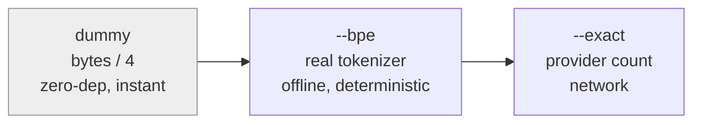

# itok

Estimate the token / context cost of files and changes, from the command
line. `git`- and `du`-shaped, so if you know those tools you already know
this one.

Honest by design: the default is an *estimate* and says so out loud.
`itok` never claims a measurement it cannot make.

```text
$ itok estimate -h --top 3
   ~38k itok  SPEC.md
    ~4k itok  crates/itok/SPEC.md
    ~4k itok  Cargo.lock
   ~47k itok  total (bytes/4)
```

- `itok` = **input tokens** -- what a file costs fed *into* a model
  (not output/generation).
- `~` marks a **crude estimate**. A real tokenizer count drops it.
- `(bytes/4)` names the **method**, so the number always says how it was
  reached.

## Install

No published release yet -- build from source.

```bash
# from a checkout of the repo
cargo install --path crates/itok

# or with the pinned toolchain
nix develop --command cargo install --path crates/itok
```

That puts `itok` in `~/.cargo/bin`. Make sure that directory is on your
`PATH`.

## Commands

Today `itok` implements one verb, `estimate`. The others are on the
[roadmap](#roadmap) below.

Verb names support **prefix inference**: any unambiguous prefix works, so
`itok e`, `itok est`, and `itok estimate` are the same command. A typo that
is not a prefix is *suggested*, never run:

```bash
$ itok esimate
itok: unknown command 'esimate' -- did you mean estimate?
```

### `estimate`

```text
itok estimate [-s] [-h] [--top N] [--budget N] [--format human|json]
             [-C dir] [paths...]
```

Estimate the token cost of files. With no `paths`, it estimates every
**git-tracked** file (like `rg` respects `.gitignore`); with paths, just
those.

| flag | meaning |
|------|---------|
| `-s`, `--summarize` | only the total line (like `du -s`) |
| `-h`, `--human` | abbreviate counts: `37k`, `1M` |
| `--top N` | show only the N biggest files |
| `--budget N` | fail if any file exceeds N tokens (see below) |
| `--format human\|json` | output shape; `json` is the stable contract |
| `-C dir` | run as if started in `dir` |

Examples:

```bash
itok estimate SPEC.md                 # one file
itok estimate -s                      # whole repo, just the total
itok e -h --top 5                     # 5 biggest, human-readable
itok estimate --format json src/      # machine-readable, one line per file
```

### The precision ladder

An estimate is only as good as its method. `itok` offers a ladder from
cheap-and-crude to true, and always labels which rung produced a number.



Today only the **dummy** tier is built (`bytes/4`, the ~4-chars-per-token
rule of thumb, off by roughly 15-30%). `--bpe` (a real tokenizer, no
tilde) and `--exact` (a provider's own count) are on the roadmap. Because
every number names its method, you always know which you are looking at.

### Budgets: `--budget N`

Supplying `--budget` turns `estimate` into a gate. It fails if **any
single file** exceeds the budget -- "no file over N tokens". The report
still prints; the breach goes to stderr; the exit code is `1`.

```bash
$ itok estimate --budget 20k SPEC.md
   ~38k itok  SPEC.md
   ~38k itok  total (bytes/4)
itok: 1 file(s) over budget 20000:
  38785 itok  SPEC.md
$ echo $?
1
```

`N` accepts a decimal unit: `2000`, `15k`, `1M`. Drop it into CI as a
one-line ceiling with no config file to maintain.

### JSON output

`--format json` is a **stable contract** -- one JSON object per file, so
tools can parse it without guessing:

```bash
$ itok estimate --format json SPEC.md
{"path":"SPEC.md","tokens":38785,"unit":"input_tokens","estimated":true,"method":"bytes/4"}
```

`estimated` is `true` for a crude tier and will be `false` for a real
tokenizer -- the machine-readable form of the `~` marker.

## Exit codes

| code | meaning |
|------|---------|
| `0` | ok |
| `1` | over budget (a `--budget` breach) |
| `2` | usage error (bad flag, unknown command) |

## Roadmap

`itok` is built spec-first: `SPEC.md` in this directory is the design and
the build queue. Planned verbs and tiers:

- `--bpe` / `--exact` -- real tokenizer counts (the honest number)
- `diff` -- token cost of a change (`git diff`-shaped)
- `check` -- gate against a committed `.context-limits` policy
- `doctor` -- "will this fit my model's window?"
- `log` -- token-cost trend across git history
- `fit` -- greedy subset that fits a `--window` budget
- `--ollama` -- exact counts + live windows from a local model server

See `SPEC.md` for the invariants and `CONTRIBUTING.md` for how to build
the next one.

## License

MIT. See `LICENSE`.
