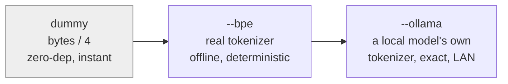

# itok

<!-- BEGIN badges -->
[](https://github.com/pr0d1r2/itok/actions/workflows/ci.yml)
[](LICENSE)
[](https://crates.io/crates/itok)
[](https://docs.rs/itok)
[](Cargo.toml)
[](Cargo.toml)
[](docs/THIRD-PARTY-NOTICES.md)
[](docs/THIRD-PARTY-NOTICES.md)
[](Cargo.toml)
[](hk.pkl)
[](hk.pkl)
[](hk.pkl)

[](flake.nix)
[](flake.lock)
[](flake.nix)
[](flake.nix)
[](flake.nix)
[](flake.nix)

[](https://claude.com/claude-code)
[](https://www.anthropic.com/claude)
[](SPEC.md)
<!-- END badges -->

Read [LLM-DISCLAIMER](docs/LLM-DISCLAIMER.md) first.

Estimate the token / context cost of files and changes, from the command
line. `git`- and `du`-shaped, so if you know those tools you already know
this one.

Honest by design: the default is an *estimate* and says so out loud.
`itok` never claims a measurement it cannot make.

```text
$ itok estimate -h --top 3
       ~25k itok  SPEC.md
        ~9k itok  src/topcmd.rs
        ~8k itok  pkl/Config.pkl
       ~43k itok  total (bytes/4)
```

- `itok` = **input tokens** -- what a file costs fed *into* a model
  (not output/generation).
- `~` marks a **crude estimate**. A real tokenizer count drops it.
- `(bytes/4)` names the **method**, so the number always says how it was
  reached.

## Why

A context window is a budget, and most tools spend it silently. You discover
what a file cost after it is already resident — re-billed on every turn,
crowding out the reasoning you were trying to buy.

`itok` makes that cost visible *before* you pay it, with the grammar you
already use for the other resource you count: `du` for what is big, `git
diff` for what changed. Point it at a tree and it tells you what entering
costs; point it at a commit and it tells you what the change added.

The design rule underneath is that a number must name its own method: `~`
marks an estimate, a real tokenizer count drops it, an exact count names the
endpoint that produced it. A confident figure the tool cannot justify is the
defect this one exists to avoid.

## Install

```bash
cargo install itok
```

With [Nix](https://nixos.org), no Rust toolchain needed:

```bash
nix run github:pr0d1r2/itok -- estimate SPEC.md   # run without installing
nix profile install github:pr0d1r2/itok           # or install
```

Three outputs: `default` (the `--bpe` tokenizer included), `itok-minimal`
(the zero-dependency `bytes/4` core), and `itok-ollama` (adds the
LAN-exact tier).

Or from a checkout:

```bash
cargo install --path .
```

That puts `itok` in `~/.cargo/bin` -- make sure it is on your `PATH`.

## Prefix inference

Verb names support **prefix inference**: any unambiguous prefix works, so
`itok e`, `itok est`, and `itok estimate` are the same command. A typo that
is not a prefix is *suggested*, never run:

```bash
$ itok esimate
itok: unknown command 'esimate' -- did you mean estimate?
```

The full command reference is [below](#commands); `itok docs` prints it and
is the source of that section.

## The precision ladder

An estimate is only as good as its method. `itok` offers a ladder from
cheap-and-crude to true, and always labels which rung produced a number.



All three rungs are built. `dummy` (`bytes/4`, the ~4-chars-per-token rule
of thumb, off by roughly 15-30%) is the zero-dependency default; `--bpe`
is a real tokenizer (o200k, offline, deterministic, no tilde); `--ollama`
gets an exact count from a local model's own tokenizer over the LAN --
keyless, no cloud, no network in the core. Because every number names its
method, you always know which you are looking at.

## Budgets

Supplying `--budget N` turns `estimate` (or `diff`) into a gate: it fails
if a file -- or a change's delta -- exceeds the budget. The report still
prints; the breach goes to stderr; the exit code is `1`.

```bash
$ itok estimate --budget 20k SPEC.md
   ~38k itok  SPEC.md
   ~38k itok  total (bytes/4)
itok: 1 file(s) over budget 20000:
  38785 itok  SPEC.md
$ echo $?
1
```

`N` accepts a decimal unit: `2000`, `15k`, `1M`. Drop it into CI as a
one-line ceiling with no config file to maintain.

## JSON output

`--format json` is a **stable contract** -- one JSON object per file, so
tools can parse it without guessing:

```bash
$ itok estimate --format json SPEC.md
{"path":"SPEC.md","tokens":38785,"unit":"input_tokens","estimated":true,"method":"bytes/4"}
```

`estimated` is `true` for a crude tier and `false` for a real tokenizer --
the machine-readable form of the `~` marker.

<!-- BEGIN itok docs -->
## Commands

Every verb, its synopsis and what it does. Regenerate with `itok docs`.

### `estimate`

```text
estimate [-s] [-h] [--top N] [--budget N] [--bpe] [--ollama[=HOSTS]] [--format human|json] [-C dir] [paths...]
```

Token cost of files, git-tracked by default. `--budget N` turns it into a gate.

`--bpe` swaps bytes/4 for a real tokenizer (o200k); `--ollama` gets an exact count from a local model's own tokenizer, and a bare host needs the `=` form (`--ollama=$OLLAMA_HOST`). The two tiers agree on DELTAS even where they differ on absolutes, so `--bpe` answers which of two texts costs less without a fleet.

### `doctor`

```text
doctor [--session [<id>]] [--model X[,Y...]] [--window N] [--ollama[=HOSTS]] [-h] [--format human|json] [-C dir] [paths...]
```

Advisory health check over a fileset, or over a running session with `--session`. Reports and suggests; never gates.

Over a fileset: fit-to-window, budget balance, noise ratio, estimate confidence. `--model X` resolves an encoding via `.context-models`; `--model a,b` narrows an `--ollama` fleet, and one unresolvable name fails the call.

`--session [<id>]` retargets the whole verb at a running context. It prints `headroom`'s row -- window, used, avail, use%, the rate triple, `~turns left` -- then projects each item's occupancy across the turns remaining, biggest first. A transcript carrying a compaction boundary already dropped items, so its projection is labelled an upper bound. No capacity means no `~turns left` and no projection, and the report says which absence it is. A second positional is a usage error: this form has no fileset.

When `use%` crosses the line `fit` warns at, and only then, it ends with advice: the two levers measured to help, and the one it rejects by name.

### `diff`

```text
diff [<A> <B> | <A>..<B> | <ref>] [--staged] [--exit-code] [--budget N] [--bpe] [-- <path>]
```

Token delta between two points, git-diff-shaped. Default is the working tree against HEAD.

`--exit-code` or `--budget N` makes it a gate.

### `show`

```text
show [<commit>] [-- <path>] | show <commit>:<path>
```

One commit's per-file token delta. Default HEAD.

The `<commit>:<path>` form reports a single blob's cost at that ref.

### `log`

```text
log <path> [<A>..<B>] [-n N] [--since D] [--reverse] [--bpe] [--format human|json]
```

A path's token cost and delta across every commit that touched it -- the creep curve.

Report-only, git-log-shaped.

### `check`

```text
check [-C dir] [--format human|json]
```

Gate registered paths against `.context-limits`. Exit 1 on any breach.

The tokenizer is pinned (`--bpe`), so the verdict is deterministic across machines.

### `guard`

```text
guard
```

Hook adapter: one harness payload on stdin, one decision on stdout.

Decides from `.context-policy` -- per-glob and per-tool budgets, with pins allowed absolutely. No policy file means allow, silently, so enforcement never self-enables. The decision is in the JSON, never in the exit code.

### `fit`

```text
fit --window N [--by size] [--bpe] [--format human|json] [-C dir] [paths...]
```

Greedy subset of files that fits a token window; emits a pipeable path list.

Git-tracked by default. `itok fit --window 200k src/ | xargs cat` builds a context bundle under budget.

### `trace`

```text
trace [<session>] [-n N] [--since D] [--reverse] [--format human|json]
```

Runtime load events for a session, one line each, chronologically.

What entered the context, when, and how big. Defaults to the newest transcript for the working directory. Report-only, and per-event sizes are estimates (`bytes/4`): no content is stored, so there is nothing to tokenize.

### `top`

```text
top [<session>] [-- <path>] [-h] [-s] [--top N] [--format human|json]
```

Ranked context occupancy for a session, `du`-shaped. Report-only.

How much each thing cost, how many times it was loaded, how many turns since, and how much cache re-billing it has `carried` since it entered. Whether that product is exact is read off the session: a transcript carrying a compaction boundary had items leave, so its `carried` is an upper bound and the report names when.

`-- <path>` narrows to one path's loads. Ends with the accounted-vs-unaccounted split, each number naming its method.

### `headroom`

```text
headroom [<session>] [--model X] [--window N] [--task N] [-h] [--format human|json] [-C dir]
```

`df` for a context: window, used, avail, use%, the growth rate, and `~turns left`. Report-only.

The rate is over the last 10/50/200 TURNS -- context grows per turn, so a per-second rate would be meaningless. Without `--window` or `--model` there is no capacity, so `avail`/`use%`/`turns left` report as absent rather than against a guessed window. `--task N` adds a `tasks left` column: N is the WINDOW a task occupies, not what it bills.

### `calibrate`

```text
calibrate [<session>] [-h] [--format human|json] [-C dir]
```

What a session's context actually cost against what itok estimated.

A fixed overhead the transcript cannot see (system prompt + tool schemas) and a scale from `bytes/4` to real tokens, with the error BAND measured on turns the fit never saw, plus `n` -- never a bare factor. Too few turns reports `n` and no factor. The scale absorbs message framing and unrecorded reasoning, so it is derived per session and is not a tokenizer ratio.

### `rate`

```text
rate [<session>] [--statusline] [--color auto|always|never] [--format human|json] [-C dir]
```

Pre-formatted badge for a statusline: occupancy, the bill, and growth per hour and per day.

Cell 1 is a LEVEL: the last turn's billed input, coloured as a fill gauge against the point the session is heading for -- `[rate].compact` if declared (one number, or a table keyed by model), else the auto-compact point this session's own transcript recorded, else the model's window. 24-bit where `COLORTERM` allows, three bands otherwise, and the last tenth also takes a `!`. A zero window is never painted: an absent measurement is not an empty context.

Cells 3 and 4 divide GROWTH -- the sum of positive window deltas -- not the bill, which is mostly cache re-reads and so measures how long the session has run rather than how full it is getting. Cell 2 keeps the bill under a name that says so; it is what the API was asked to charge, which is neither money nor content.

A fifth cell appears when a red line resolved and the context is growing: time to it at the recent rate, floored and tilde'd, in ACTIVE seconds. Rates divide by active time, each inter-turn gap credited up to 300 seconds.

`--statusline` reads the harness payload on stdin and emits `(itok:...)`; colour defaults to `always` there. `--color` reads `[rate]` thresholds from `itok.toml`; a metric with no threshold gets no colour. 0-1 turns hides the badge, but `--format json` still returns one object with `null` where nothing was measured.

### `cap`

```text
cap [N] [--footer human|json]
```

Token-budget filter for a pipe: the longest whole-line prefix that fits N tokens, and it announces the cut.

The footer says what was kept, what was elided, and the line and byte offset to resume from, so the next read continues rather than restarting. The line number is exact on any stream; the byte offset is of the decoded text, so it is for UTF-8 input. `head` truncates silently by lines or bytes; this truncates by tokens and says so. Without N nothing is cut and the footer just reports the cost.

### `docs`

```text
docs
```

Print this command reference as markdown -- the source for README's generated block.

Kept in sync by a guard, so the block and this table cannot disagree.

## Exit codes

| code | meaning |
|------|---------|
| `0` | ok |
| `1` | budget breach or nonzero delta |
| `2` | usage error |
| `7` | network error (`--ollama`) |
<!-- END itok docs -->

The command reference above is **generated**: `itok docs` prints it, and a
test fails if this block drifts from the code. Edit the registry in
`src/docs.rs`, never the block by hand.

## Use it as a library

The CLI is a thin shell over a pure function, so a caller gets the same
verdict without spawning a process:

```rust
use itok::cli;
let out = cli::run(&["estimate".into(), "--format".into(), "json".into()]);
assert_eq!(out.code, 0);
```

`Output` carries stdout, stderr and the exit code the binary would have
used. The pieces are public too — `estimate`, `bpe`, `session`, `walk`,
`render`, `json` — so a consumer can take the measurement without the
grammar around it.

This is not hypothetical: [`blackbox`](https://github.com/pr0d1r2/blackbox)
depends on `itok` with `features = ["bpe"]` to size the slices it feeds to a
model.

## Guarantees

Each of these is checked by something, not asserted here:

- **A number names its method.** Every figure carries the tier that produced
  it — `bytes/4`, `o200k`, or `exact via <model>@<host>` — and `~` marks a
  crude estimate. `itok` never claims a measurement it cannot make.
- **Deterministic.** The same input yields the same count. `check` pins its
  tier so a gate's verdict cannot drift with a flag.
- **Offline by default.** The default build needs no network at all. The
  exact tier is feature-gated and opt-in, and its tests replay a recorded
  cassette rather than reaching a server.
- **The minimal tier is genuinely zero-dependency** — `--no-default-features`
  resolves to nothing, and that is a *build* in CI (`nix build
  .#itok-minimal`), not a promise in prose.
- **The JSON contract is stable.** One object per file, so a caller parses
  rather than guesses.
- **Reporting and gating are separate.** Report-only verbs never fail;
  gating is an explicit act — `--budget`, `check`, `guard` — so nothing
  starts refusing your commits because you asked it a question.
- **No `unsafe`.** `unsafe_code = "forbid"`, so it cannot be reintroduced in
  a local module.

## Status

`0.3.0` — the first public release. A minor here is a level of
**guarantee**, not a feature count, and `0.3` is an *odd* minor, which the
ladder reserves for a fix release between milestones (§V70). It says what is
not done: `0.4` means "knows what a context costs", and that is still open.

Publication is deliberately **not** a rung (§V107). The ladder once made
`0.7` the first public release, welding who-can-install-it onto
what-it-guarantees — leaving only two moves, wait or overstate. This ships at
the rung that is true, early, because real use finds what another pass over
our own tree does not.

An `-rc.1` came first because crates.io is immutable. It found five defects
no dry run reaches, two of which would have been permanent.

Fourteen verbs are built. The reduction ladder (`cap --strip` and friends)
and `doctor --session` are specced and **not** built — `SPEC.md` `§I` marks
them so, and the binary rejects them rather than pretending.

## Changelog

See [CHANGELOG.md](CHANGELOG.md).

## Contributing

`itok` is built spec-first: `SPEC.md` is both the design and the build
queue, and a contribution means taking the next task from it and making it
pass the gate.

- [docs/CONTRIBUTING.md](docs/CONTRIBUTING.md) — setup, the loop, and what
  gets a patch turned down
- [docs/INTEGRATION.md](docs/INTEGRATION.md) — how the gate is wired, and
  how to reproduce any verdict without `hk`
- [docs/CODE_OF_CONDUCT.md](docs/CODE_OF_CONDUCT.md) — how discussion here
  is expected to go
- [AGENTS.md](AGENTS.md) — what to do when a specific step fails

## Security

Report privately rather than in a public issue — see
[docs/SECURITY.md](docs/SECURITY.md), which also states plainly what the
attack surface is and is not.

If you are reporting something involving session transcripts, do not attach
a real one: they contain actual conversation content.

## License

MIT. See [LICENSE](LICENSE).

Third-party dependencies vary by feature tier — the minimal build has none
at all. See [docs/THIRD-PARTY-NOTICES.md](docs/THIRD-PARTY-NOTICES.md).
