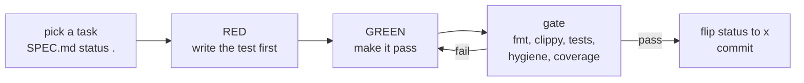

# Contributing to itok

`itok` is built **spec-first**. The design and the build queue are the same
document: `SPEC.md`. Contributing means picking the next task from that
queue and making it pass the guards. A human or an agent can drive the
loop the same way.

## The loop



- **`SPEC.md` is the queue.** Each `§T` row has a status: `.` not started,
  `~` in progress, `x` done. Pick the lowest-numbered `.` whose
  dependencies are met.
- **The guards are the gate.** Every change is held to the same standard,
  so a wrong step *fails* instead of silently shipping. That is what lets
  the loop run without constant supervision.
- **The invariants are the law.** `§V` records why things are the way they
  are. A task cites the invariants it must respect; read them before you
  start.

## Setup

The toolchain is pinned. From a checkout:

```bash
nix develop                    # drops you into the pinned shell
cargo nextest run              # run the tests
cargo clippy --all-targets     # the deny-list is strict on purpose
cargo fmt --all                # formatting is not optional
```

No `nix`? A recent stable Rust with `cargo-nextest` and `cargo-llvm-cov`
works too; the pinned shell just guarantees the versions.

### Hooks

The gate is defined once, in `hk.pkl`, and run by [hk]. The dev shell
provides `hk`; install the hooks once, globally, and every repo with an
`hk.pkl` is covered (repos without one are a silent no-op):

```bash
hk install --global            # needs git 2.54+; once per machine
```

Per-repo `hk install` also works, but do not do both -- git aggregates
`hook.<name>.command` across scopes, so hooks would fire twice.

`pre-commit` runs the fast set, `pre-push` adds the ollama axis and
coverage. `HK=0 git commit` bypasses for one command.

The gate is silent when it passes. When it fails it says what broke and
how to fix it; [AGENTS.md](../AGENTS.md) is the full playbook, written for
agents and humans alike.

You do not need `hk` to reproduce a verdict: every step in `hk.pkl` is a
plain cargo command you can paste into a shell.
[INTEGRATION.md](INTEGRATION.md) describes how the whole thing fits
together and lists every command.

[hk]: https://hk.jdx.dev

## The one hard rule

**Do not bypass a failing gate.** `HK=0`, lowering a threshold, silencing a
lint, marking a test `#[ignore]` to get past it -- all of these ship the
defect with the alarm switched off, which is worse than shipping it loudly.

If a step is wrong, that is a real and welcome finding: say so, and change
the step deliberately, in its own commit, with the reason written down. The
objection is to *routing around* a verdict, not to disagreeing with one.

## Adding a verb

The command surface is a pure function -- `cli::run(args) -> Output` --
so nearly everything is unit- and property-tested at library cost, not by
spawning the binary. To add a verb:

1. Add a variant to `Verb` and a row to the `VERBS` table in `verb.rs`.
   The `match` in `dispatch` is exhaustive, so the compiler will tell you
   what is missing until it is wired.
2. Put the logic in its own module, tested there. Reuse the shared
   machinery (`estimate`, `walk`, `render`, `json`, the unit parser) --
   it is already tested, so your verb adds little.
3. Write the tests first. Wiring is a unit test against `run`; the
   permutation space is a `proptest` invariant, not a hand-enumerated
   list. Only the process boundary (exit code, stream routing) needs an
   end-to-end test.

## What the gate checks

All of it is defined in `hk.pkl` and reached three ways from that one
definition: the `pre-commit` hook (the `fast` set, 26 steps), the
`pre-push` hook and `hk check` in CI (the `all` set, 32 steps).

The ones you will meet most:

- **`cargo fmt --check`** -- one formatting, no debate.
- **`cargo clippy`** -- a strict deny-list (no `unwrap`, no `panic`, no
  silent integer overflow, function- and module-length caps). The limits
  are a design tool: if a function will not fit, it usually wants
  splitting.
- **`cargo test`** -- unit, property and end-to-end tests.
- **`itok`** -- itok gating itself against `.context-limits`.
- **`mth` / `mth-check`** -- `SPEC.md`'s format and structure, enforced by
  `microlith`, which owns that format. There is no second implementation
  here; there used to be, and it drifted.
- **hygiene** -- whitespace, line endings, BOMs, smart quotes, private
  keys, secret shapes, case conflicts, broken symlinks. The fixable ones
  fix themselves on commit.

Added on push, because they cost real time:

- **`cargo test --features ollama`** -- the network backend, replayed
  offline from a recorded cassette. No server, no network.
- **`no-default-features`** -- proves the minimal tier is still genuinely
  zero-dependency.
- **`package`** -- what the published `.crate` would actually contain.
- **`coverage`** -- `--fail-under-lines 98`, itok's own standalone figure.
  Cover the gap rather than lower the bar.
- **`semver`** -- the public API against the newest release tag.

[INTEGRATION.md](INTEGRATION.md) has the full list, the ordering, and the
gaps that are known and unfixed.

## Design laws worth knowing

Two invariants shape almost every decision here (`§V` has the rest):

- **Convention over novelty.** Default to the form `git`, `du`, or `rg`
  already use. Convention is free -- it lives in muscle memory and in a
  model's prior -- and novelty is taxed every time it must be taught.
- **Estimation, honestly.** The default is an estimate and says so. A
  number always names its method and marks whether it is crude. `itok`
  never claims a measurement it cannot make.

## Things that will get a patch turned down

Not to be discouraging -- these are the recurring ones, and knowing them in
advance is cheaper than finding out in review:

- **A bypassed or weakened gate.** See the hard rule above.
- **A second implementation of something that already has an owner.** The
  spec format belongs to `microlith`; the command reference is generated
  from `src/docs.rs`. A hand-maintained copy of either will drift, and has.
- **A number with no method.** `itok`'s premise is that an estimate says it
  is one and names how it was reached. A confident figure the code cannot
  actually justify is the defect this tool exists to avoid.
- **A new dependency added quietly.** The tier structure is a promise about
  dependency footprint. Taking a dependency is a decision that belongs in
  the commit message, and at the minimal tier it is not available at all.
- **Novel form where a conventional one exists.** Default to the shape
  `git`, `du` or `rg` already use.
- **A test that asserts the implementation rather than the behaviour.**
  Prefer a property over a hand-enumerated permutation list.

## Reporting a bug

Open an issue with what you ran, what you expected, and what happened.

If it involves session transcripts, **do not attach a real one** -- they
contain actual conversation content. Send a synthetic `.jsonl` that
reproduces the shape, or describe it. Security issues go privately instead:
see [SECURITY.md](SECURITY.md).

## Commits

One logical change per commit, and the commit message carries the *why*,
not just the *what*. When a task completes, flip its `§T` status to `x` in
the same change.

## License

By contributing, you agree that your contributions are licensed under the
MIT License, the same terms as the rest of the project -- see
[LICENSE](../LICENSE).
