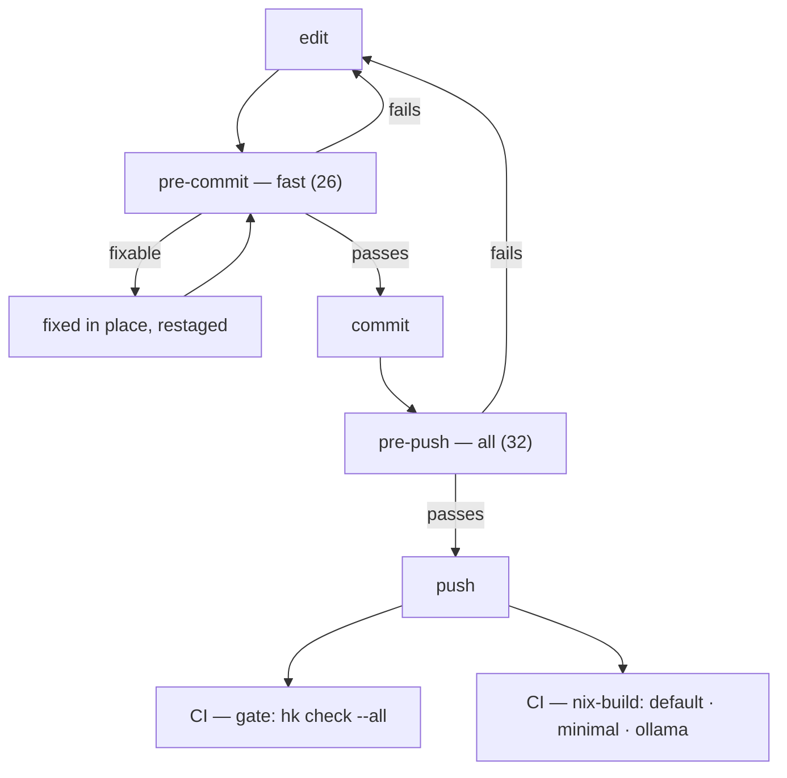

# Integration

How `itok`'s gate is put together, and how to reach any part of it by hand.

This document describes the gate. The gate itself lives in `hk.pkl` and is the
only definition of it — if the two ever disagree, `hk.pkl` is right and this
file has a bug. A step checks the arithmetic below so at least the counts
cannot drift silently.

## One definition, three callers

There is exactly one place the operations are written down: **`hk.pkl`**. Three
things run it, and none of them restates it.

| caller | set | when |
|---|---|---|
| `pre-commit` hook | `fast` — **26 steps** | every commit |
| `pre-push` hook | `all` — **33 steps** | every push |
| `hk check --all` in CI | `all` — **33 steps** | every push and PR |

`all` is `fast` plus six: `ollama`, `no-default-features`, `package`,
`rustdoc`, `coverage`, `semver`. Those six either compile a second
configuration, measure something, or reason about a published artefact, so they
cost real time and are not worth paying on every commit.

`.github/workflows/ci.yml` does not list any operation. It enters the pinned
dev shell and delegates:

```yaml
# job: gate
- run: nix develop --command hk check --all --check
# job: nix-build, a matrix, concurrent with the above
- run: nix build .#${{ matrix.package }}
```

The three `nix build`s are a separate, concurrent job because they prove
something the test suite cannot: that each feature configuration builds as a
sealed, reproducible artefact. `itok-minimal` in particular is how the
zero-dependency claim stays true rather than remembered. Measured cold, all
three finish inside 70 seconds.

Fail-fast **both** in CI and locally. CI used to pass `--no-fail-fast`, on the
reasoning that an expensive round-trip deserves every failure in one pass.
That reasoning was sound and the flag was still wrong: hk stops producing
output entirely once a `depends`-chained step fails under it, so the run
reported nothing at all until it was killed. A complete list from a run that
never finishes is worth less than one failure in ninety seconds.

## The path a change takes



The two CI jobs run **concurrently**. They share no cargo artifacts — the
`nix build`s are sandboxed — so running them in sequence only added one
cost to the other.

The fixable hygiene steps repair the file and restage it rather than failing:
whitespace, final newlines, line endings, smart quotes, TOML formatting. You do
not fix those by hand.

`stash = "git"` on `pre-commit` is correctness, not speed. Without it, a
partially staged file (`git add -p`) is checked as it looks in the worktree,
which gives you a verdict about code you are not committing.

## What runs on which files

Most steps take `{{files}}` — only what changed. Three deliberately do not:

- **`package`** globs `**/*` because *deleting* a required file must trip it,
  and a deleted file never appears in the changed set.
- **`package-suite`** globs `**/*` for the same reason, one layer along: it
  tests the tarball, and any file can change what the tarball does.
- **`itok`** checks registered paths against `.context-limits`, which is about
  the file's total size, not the diff.
- **`mth-check`** reads `SPEC.md` whole; a structural rule is about the
  document, not the edit.

`pkl/` is excluded from every fixer. It is upstream's vendored schema, and
reformatting someone else's file on our commit is how a vendored copy stops
being a copy.

## The steps that guard claims, not code

Most of the 33 are ordinary: a formatter, a linter, a test runner, hygiene.
Eleven exist because this repository makes a *claim* somewhere, and a claim with
no runner is just a sentence (`§V17`). The count said six while the table
listed ten, which is the drift `integration-doc` checks for and cannot see:
it does the arithmetic on the step totals, not on the prose around them.

| step | the claim it makes true |
|---|---|
| `itok` | "no file grows past its declared context ceiling" — `itok` gating itself, which is also the only real dogfooding in the gate |
| `mth` / `mth-check` | "`SPEC.md` obeys the format it is written in" — enforced by `microlith`, the format's owner, rather than by a second implementation here |
| `no-default-features` | "the minimal tier is genuinely zero-dependency" |
| `package` | "the published `.crate` carries what a consumer needs" — the one failure that *cannot* reproduce by running the suite here, because the repo still has the file |
| `package-suite` | "and what it carries *works*" — the `.crate` unpacked outside this worktree and put through its own tests, with `ITOK_DOGFOOD` unset, which is the consumer's situation exactly. `cargo package --verify` only compiles; fifteen tests read this repo's git history and failed on the tarball while staying green here (`§B17`) |
| `coverage` | "98% line coverage, on this crate alone" — not a workspace aggregate, which would be inflated by siblings |
| `semver` | "the version number tells maturity true" — vacuous until the first `v*` tag, and it says so on stderr rather than passing quietly |
| `ripsecrets` | "no credential is going into a public history" — reads the working tree, so it says nothing about history; history was scanned once, separately |
| `integration-doc` | "this document still describes the gate" — the arithmetic only, because whether a paragraph is still true is a judgement and a mechanical check should not pretend to make one |
| `readme-badges` | "every number on the README badges is true" — each read from the file that owns it, so a badge cannot drift from the manifest, the flake or the floor |
| `links` | "every relative link resolves" — offline only; external URLs are someone else's uptime |

## Why the steps are chained

`depends` is not about correctness — every step is independent. It is about
which failure you are shown *first*, because the first one is usually the only
one you want.

```text
fmt → clippy → test → doctest → itok ─┬→ mth → mth-check
                                      └→ ollama → no-default-features
                                          → package → rustdoc → coverage → semver
```

Cheapest and most-likely-to-fire first. There is no point reporting a coverage
shortfall on code that does not compile, and no point reporting a clippy lint
on code that is about to be reformatted. The chain forks at `itok` because the
spec-format branch and the build-configuration branch have nothing to say to
each other.

The hygiene steps carry no `depends` at all. They are independent and cheap, so
they run concurrently.

## Where spec-driven development fits

`SPEC.md` is the design and the build queue in one document. `§V` records
invariants — why things are as they are. `§T` is the task queue, each row with
a status (`.` not started, `~` in progress, `x` done) and the invariants it must
respect. `§B` records bugs and what each one taught.

The gate does not read `§T`. It enforces the *format* (`mth`) and the
*consequences* (`clippy`, `coverage`, the claim-guarding steps above). What
belongs in the spec versus what belongs in a runner is the recurring judgement
call here, and `§V17` is the rule: if a claim matters, something has to be able
to fail on it.

## Getting the hooks

```bash
hk install --global      # needs git 2.54+; once per machine
```

Global covers every repository with an `hk.pkl`; those without one are a silent
no-op. Per-repo `hk install` also works — but do not do both, because git
aggregates `hook.<name>.command` across scopes and every hook would fire twice.

Entering the dev shell installs the hooks for you, written by hand rather than
via `hk install`, and skipped entirely when a global install already exists. A
shell without `hk` degrades to one line on stderr rather than making every git
command fail.

`HK=0 git commit` bypasses for one command. It exists for genuine emergencies
and is the wrong tool for a failing gate — see the one hard rule in
[`CONTRIBUTING.md`](CONTRIBUTING.md).

## Reproducing any verdict without hk

Every step is a plain command. You never need `hk` to find out what it thinks:

```bash
cargo fmt --all --check
cargo clippy --all-targets --all-features -- -D warnings
cargo nextest run
cargo nextest run --features ollama
cargo nextest run --no-default-features
cargo llvm-cov nextest --features ollama --fail-under-lines 98
cargo package --list --allow-dirty
mth fmt --check SPEC.md
mth check --records .spec-records SPEC.md
```

If `hk` is unavailable, read the command out of `hk.pkl` and run it. The gate
never depends on `hk` to be reproducible — that is the point of keeping every
step a single shell command.

## Refreshing the coverage cache

The README's coverage badge is rendered on every commit but measured only on
push. That works because the number lives in `.coverage`, a cache:

```bash
hk run refresh     # measure, update .coverage, regenerate the badges
```

`readme-badges` is cheap because it reads that file; `coverage` is what keeps
the file honest, comparing it against a real instrumented run and failing if
they disagree. So a moved coverage number surfaces on push, not silently.

`.coverage` also carries a `key` — a git hash over the files that can move
coverage. It is stamped by `refresh` and is there so a human can tell whether
the cached number is current without paying for a measurement. Nothing gates
on it; the measurement on push is the gate.

## Two rules that shape all of this

- **One definition (`§V7`).** Anything stated twice will eventually disagree.
  This is why `ci.yml` delegates instead of listing steps, why `microlith` owns
  the spec format instead of a ported copy here, and why the command block in
  `README.md` is generated from the same registry the CLI dispatches on.
- **A claim needs a runner (`§V17`).** A guarantee nobody can fail is a
  sentence. Most of the unusual steps above exist because a claim was being
  made in prose with nothing behind it.

## Known gaps

Stated rather than left to be discovered:

- **`semver` is vacuous.** No `v*` tag exists, so it has no baseline to diff
  against. It reports that on stderr every run and arms itself at the first
  release tag.
- **`ripsecrets` cannot see history.** It reads the files in front of it. The
  full history was scanned once, by hand, and was clean; nothing keeps that
  true automatically.
- **`coverage` is a floor, not a ratchet.** 98% overall. A per-file regression
  under the floor does not fail.
- **No platform matrix.** CI is `ubuntu-latest` only. macOS and an MSRV axis
  are planned (`§T60`).
- **The caches are a modest win, not the fix.** They were added believing CI
  was slow. It was not: the gate reaches its first test **79 seconds** after
  the step starts, cold, and the 3.2 GiB dev shell materialises in **26** of
  those. The hour-long runs were hk going silent after a chained step failed
  under `--no-fail-fast` — 74 minutes of no output on one run, 43 on another.
  The caches save roughly half a minute and are kept on that basis. The cargo
  one is reasoning rather than measurement, and if the two ever compete for
  the 10 GB repository budget it is the one to shrink first (`§T60`).
- **`--no-fail-fast` is off in CI**, so a red run reports its *first* failure
  rather than every failure. That is a downgrade taken deliberately: under
  the flag, hk produced no output at all after a failure, and a complete list
  from a run that never reports one is worth nothing. Restore it when hk
  stops deadlocking.
- **`cargo-deny` is not wired.** The dependency tree is not checked for bans,
  licences or advisories. `§V23`'s "no async runtime" is
  currently enforced only by `no-default-features` compiling, which does not
  see what the `ollama` tier pulls in.

## Deeper

- [`CONTRIBUTING.md`](CONTRIBUTING.md) — the development loop and what gets a
  patch turned down
- [`../AGENTS.md`](../AGENTS.md) — what to do when a specific step fails
- [`../SPEC.md`](../SPEC.md) — the invariants and the task queue
- [`SECURITY.md`](SECURITY.md) — the attack surface, stated honestly
